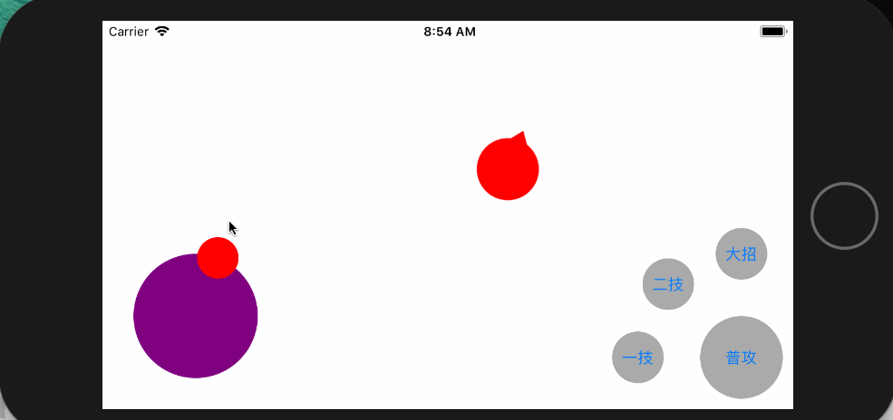
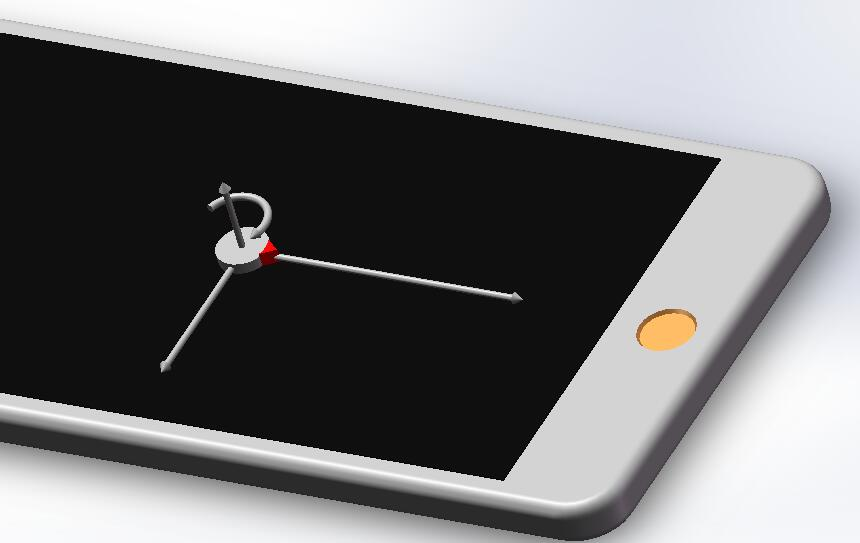
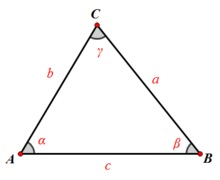
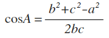

# iOS浅谈王者荣耀摇杆封装
---
先看看粗糙的效果图

分析下英雄的动作

> **X**轴、**Y**轴平移
> 
> **Z**轴旋转

假定英雄的速度为**speed**，面部朝向角度**angle**

| X方向偏移量  | X方向偏移量 | Z轴旋转角度 |
|:-------------:|:---------------:|:-------------:|
| speed * cos(angle) | speed * sin(angle) | angle |

摇杆需要对外给出的必要接口是**angle**变化时候的回调。

对于IOS设备不改变锚点的情况下**X**向右为正， **Y**向下为正，**Z**顺时针、水平向右为起始方向，有点晕，要说错了帮我纠正下。

如下图（图画的太糙，将就看先）

####这里只按照标准的做直角坐标系去计算，从X轴正方向开始，逆时针为角度的变化方向

通过 *余弦定理* 很容易算出角度（知道起点跟手势移动的点即可）

推荐一款Mac下的公式编辑器 [Daum Equation Editor](https://itunes.apple.com/cn/app/daum-%E5%85%AC%E5%BC%8F%E7%BC%96%E8%BE%91%E5%99%A8/id540665783?mt=12)

####计算出角度之后余下的问题就迎刃而解了，改变英雄视图的位置即可
定义一个Hero对象，持有一个heroView，暂时有**angle**、**speed**、**state**属性，给**Hero**添加一个**move**和**stop**方法，来操作英雄即可。

****
感谢您阅读完毕，如有疑问，欢迎添加QQ:**714387953**(蜗牛上高速)。
**github**:[https://github.com/yhl714387953/KingOfGlory](https://github.com/yhl714387953/KingOfGlory)
如果有错误，欢迎指正，一起切磋，共同进步
如果喜欢可以**Follow、Star、Fork**，都是给我最大的鼓励